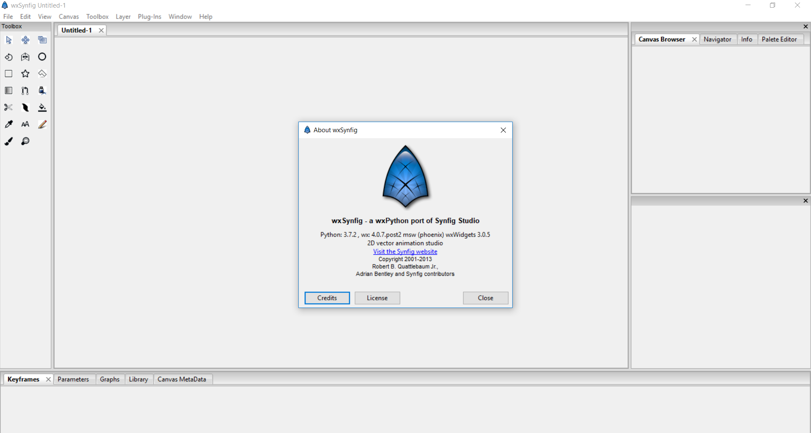

wxSynfig
====================
A Synfig GUI port to wxPython

Dependencies
--------------
- Python 3.7.2
   - https://www.python.org/downloads/
- wxPython 4.0 or later
   - pip install wxPython==4.0.7.post2    

Run:
- `python src\studio\gui\main.py`

Screenshot
-----------

